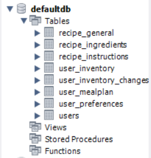
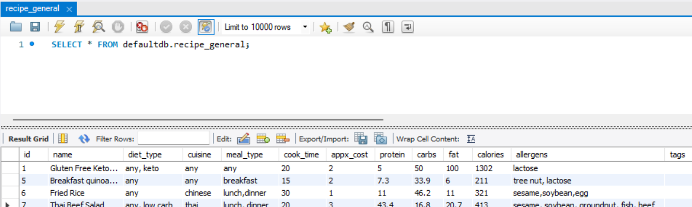

# Meal Planner

A full-stack **meal planning and inventory management web app** that helps users plan meals, view wide range of recipes, manage their pantry automatically, and stay within budget — all in one place.  

This project was built for Scholastica Tech Summit'25 for 'Innovator's Arena' segment

View the page on **https://oh-no-they-died.vercel.app**

(.env files needed to run locally have not been shared on this repository)

---

## Features

- **User Accounts** — Secure login & regitration with authentication methods(such as hashed passwords, secure JWT)
- **Recipe Database** — Browse and search recipe list. View recipe insstructions and nutritional facts with recipe scaling
- **Meal Planning** — Create custom weekly meal plans with variable servings
- **Smart Inventory** — Track pantry items, automatically updates when meals are added to plan
- **Personalization** — Recommendations based on user preferences provided
---

## Code and Server Info

**Frontend**  
- The Application has been created in React
- Frontend server has been hosted on **https://oh-no-they-died.vercel.app**
- The following React dependencies have been used: React Drag-and-Drop, React Router for switching page, Lucide React for icons, React Toastify for cleaner toasts

**Backend**  
- The backend has been creted using Node.js and Fastify dependency.
- Backend server has been hosted on **https://oh-no-they-died.onrender.com**
- Database hosted on the MySQL server Aiven.io under (inaccessible for viewing)
  **oh-no-they-died-oh-no-they-died-db.c.aivencloud.com**
- JWT Authentication, hashed password and rate limits have been implemented for authentication
---

## Database Info
Database uses 7 tables:

  

Example images of each table is present in /image. Receipe_general for example looks like the following:
 

  
 
